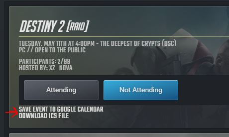

# WinterCCalLink

## What is this?
The Winter Clan website (https://winterclan.net) lists upcoming events. This script adds links on the website, next to each event block to easily allow you to add the event in your Calender. There is a link to directly open the Google Cal with pre-populated details, which you may directly review and save. If you need to add the event to your iOS calendar, Outlook etc., then you may click on the second link, which will download the .ics file instead.

## Installation
* Install Tampermonkey extension for Chrome from https://chrome.google.com/webstore/detail/tampermonkey
* In browser, open https://github.com/skr968/WinterCCalLink/raw/main/WinterCCalLink.user.js
*  Tampermonkey installation page should open. Click on "Install"

## Known Issues
* The event duration has been hard coded to 1 hour
* The code gets trigerred only if you directly open https://winterclan.net/#/events and navigate to an event day within 4 seconds.
* Navigating to next/prev event day will populate the links after around 1 second

## Issues?
Please submit any found issues at https://github.com/skr968/WinterCCalLink/issues
